# 🚀 最佳部署策略

## 问题解决方案

刚才遇到的问题：
1. ❌ GitHub Actions 权限不足
2. ❌ `.gitignore` 忽略了 `dist/` 目录

## 🎯 推荐方案：让 Cloudflare Pages 处理构建

### 为什么这样更好？

1. **无权限问题** - 不需要 GitHub Actions 推送代码
2. **更简洁** - 源码仓库只包含源文件
3. **更可靠** - Cloudflare Pages 专门为此设计
4. **更快** - 边缘构建，全球部署

### 📋 部署配置

#### Cloudflare Pages 设置
```
构建命令: npm run cf:build
构建输出目录: .
Node.js 版本: 18
根目录: /
```

#### 环境变量（在 Cloudflare Dashboard 设置）
```
NODE_VERSION=18
NPM_FLAGS=--production=false
```

### 🔄 工作流程

```mermaid
graph LR
    A[本地开发] --> B[推送到 GitHub]
    B --> C[Cloudflare Pages 检测]
    C --> D[自动构建]
    D --> E[部署到全球 CDN]
```



1. **本地开发** - 编写代码，测试功能
2. **推送 GitHub** - 只推送源码，不包含构建文件
3. **自动构建** - Cloudflare Pages 运行 `npm run cf:build`
4. **全球部署** - 自动分发到边缘节点

### 📁 文件结构

```
仓库中（源码）:
├── src/input.css          # Tailwind 源文件
├── scripts/               # 构建脚本
├── *.html                 # HTML 源文件
├── *.js                   # JavaScript 源文件
├── package.json           # 依赖和构建脚本
└── tailwind.config.js     # Tailwind 配置

构建后（Cloudflare）:
├── dist/styles.css        # 优化后的 CSS
├── dist/critical.css      # 关键 CSS
├── dist/*.min.js          # 压缩后的 JS
└── *.html                 # 优化后的 HTML
```

### 🛠️ 本地开发命令

```bash
# 开发模式
npm run dev

# 测试构建（验证 Cloudflare Pages 构建过程）
npm run cf:build

# 本地预览
npm run preview
```

### ✅ GitHub Actions 作用

现在 GitHub Actions 只用于：
- ✅ 验证构建过程能正常运行
- ✅ 运行测试和代码检查
- ✅ 提供构建失败时的调试信息
- ❌ 不再提交构建文件

### 🔧 如果需要预构建文件

如果你确实需要在仓库中包含构建文件：

1. **创建 Personal Access Token**
   - GitHub Settings → Developer settings → Personal access tokens
   - 创建 token 并添加到仓库 Secrets

2. **更新 GitHub Actions**
   ```yaml
   env:
     GITHUB_TOKEN: ${{ secrets.PERSONAL_ACCESS_TOKEN }}
   ```

3. **修改 .gitignore**
   ```gitignore
   # 不忽略 dist 目录
   # dist/
   ```

但我**强烈推荐**使用 Cloudflare Pages 构建，因为：
- 🚀 更快的部署速度
- 🔒 更好的安全性
- 🛠️ 更简单的维护
- 📦 更清洁的代码仓库

### 🎯 立即行动

1. **清理当前状态**
   ```bash
   # 删除本地 dist 目录（让 Cloudflare 构建）
   rm -rf dist/
   
   # 提交更改
   git add .
   git commit -m "🔧 Switch to Cloudflare Pages build strategy"
   git push
   ```

2. **配置 Cloudflare Pages**
   - 登录 Cloudflare Dashboard
   - 连接 GitHub 仓库
   - 设置构建命令: `npm run cf:build`
   - 设置输出目录: `.`

3. **测试部署**
   - 推送任何更改到 GitHub
   - 观察 Cloudflare Pages 自动构建和部署

### 🎉 优势总结

- **开发体验** - 专注代码，不用管构建文件
- **部署速度** - 边缘构建，秒级部署
- **全球加速** - Cloudflare CDN 自动优化
- **零配置** - 推送即部署，无需额外设置
- **成本效益** - GitHub + Cloudflare Pages 都免费

这就是现代 JAMstack 应用的最佳实践！🚀